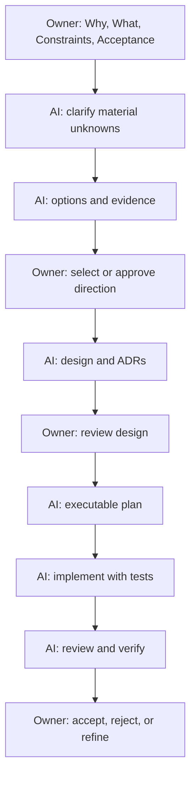

# Developer Toolbox Product Delivery Standard

## Purpose

This standard defines how Developer Toolbox work is proposed, researched, designed, implemented, reviewed, and accepted.

It establishes a clear division of responsibility:

| Role | Primary responsibility |
| --- | --- |
| Product Owner / Domain Decision Maker | Defines why the work matters, what outcome is required, the constraints, and the acceptance decision |
| AI delivery team | Acts as researcher, architect, implementer, and reviewer; presents options and evidence, turns approved decisions into working, verified deliverables |

The Product Owner is not expected to prescribe a framework, database, internal structure, or test approach. The AI must make those recommendations explicitly, state trade-offs, and provide evidence proportionate to the decision’s impact.

## The delivery contract

### Product Owner provides

| Input | Meaning | Example |
| --- | --- | --- |
| **Why** | Business or user problem and intended value | Developers need a private, offline-friendly replacement for scattered web utilities. |
| **What** | Observable outcome, not implementation detail | One Docker-deployable developer workbench with documentation search and core utilities. |
| **Constraints** | Non-negotiable boundaries | Small footprint; local and internal-server deployment; no unnecessary background services; privacy by default. |
| **Acceptance** | Conditions that make the result acceptable | Starts quickly, works offline after installation, docs are searchable, and sensitive input is not sent externally by default. |

### AI provides

| Output | Required content |
| --- | --- |
| **Options** | At least two viable approaches when the decision is material; the recommendation is identified clearly. |
| **Evidence** | Official documentation, primary sources, measured results, repository inspection, prototypes, or stated assumptions. |
| **Design** | Architecture, module boundaries, data flow, security posture, trade-offs, and explicit exclusions. |
| **Implementation** | Small executable tasks with files, interfaces, tests, commands, and commits. |
| **Verification** | Fresh evidence: test output, build result, security checks, performance measurements, and acceptance mapping. |

## Product workflow



The AI must not silently treat an implementation choice as a Product Owner decision. For example, “use SQLite FTS5 rather than Elasticsearch” is an AI architecture recommendation supported by the small-footprint constraint; “documentation must work offline” is a product constraint.

## Decision levels

| Level | Examples | AI action | Owner action |
| --- | --- | --- | --- |
| Product | target users, offline requirement, commercial scope, privacy boundary | Explain impact and offer viable choices | Decide or delegate explicitly |
| Architecture | Preact vs React, Go vs .NET, SQLite FTS5 vs Typesense | Recommend with evidence and preserve alternatives | Approve direction or delegate |
| Delivery | file layout, test fixtures, naming, chunking strategy | Decide and document | Review only when it changes product acceptance |
| Operational | image size budget, bind address, retention, update cadence | Propose measurable defaults | Approve exceptions or policy changes |

If the Product Owner says “use your recommendation,” the AI owns the implementation decision and must record the decision, rationale, alternatives, and verification method.

## Required artifacts by stage

| Stage | AI artifact | Approval gate |
| --- | --- | --- |
| Discovery | Problem framing, assumptions, questions, source inventory | Owner confirms scope and critical assumptions |
| Research | Cited findings, licensing/content assessment, feasibility and risks | Owner confirms product direction |
| Architecture | Design document, ADRs, data-flow/security model, module boundaries | Owner reviews architecture |
| Planning | Phase plan with task-level tests and commands | Owner selects execution scope/order |
| Build | Source changes, migration/assets, test additions, release notes | Code-review gate |
| Verification | Test/build/security/performance evidence mapped to acceptance | Owner accepts the release |

For Developer Toolbox, the current artifacts are:

| Artifact | Role |
| --- | --- |
| `developer-toolbox-white-paper.md` | Research-backed product and architecture direction |
| `developer-toolbox-phase-1-implementation-plan.md` | Core workbench, documentation search, structured-data, regex/text, and code-image delivery plan |
| `developer-toolbox-phase-2-implementation-plan.md` | API workbench and diagram module plan |
| `developer-toolbox-phase-3-implementation-plan.md` | Learning pack and optional team-mode plan |
| `developer-toolbox-phase-4-implementation-plan.md` | Evidence-gated extension plan |

## Research standard

The AI must distinguish facts from recommendations.

| Type | Required treatment |
| --- | --- |
| Fact that may change | Verify from an authoritative current source and cite it. |
| Technical inference | State it as an inference and explain the supporting evidence. |
| Product recommendation | State the trade-off, recommendation, and rejected alternatives. |
| License/content claim | Link to the actual license or publisher terms; do not rely on a search-result summary alone. |
| Performance claim | Label as a target until measured; report environment and actual result after measurement. |

Research must cover the whole decision boundary. For a tool incorporated into Developer Toolbox, that normally includes functionality, self-hosting feasibility, license, maintenance state, supply-chain risk, privacy implications, runtime footprint, integration path, and replacement cost.

## Architecture and design standard

Every material feature design must state:

1. **User outcome** — what users can do after the change.
2. **Module boundary** — what the module owns and what it deliberately does not own.
3. **Data classification** — browser-local, read-only pack, shared workspace data, secret, or outbound content.
4. **Trust boundary** — where input becomes executable, persistent, shared, or external.
5. **Failure behavior** — user-facing fallback and internal diagnostic behavior.
6. **Security controls** — validation, authorization, redaction, safe defaults, and audit needs.
7. **Performance budget** — startup, memory, bundle, data-size, and latency constraints when relevant.
8. **Test strategy** — unit, integration, end-to-end, security-negative, and performance checks.
9. **Rollout and rollback** — flags, migrations, content-pack compatibility, and recovery path.

### Design rule for small footprint

The AI must prefer the smallest component that satisfies the acceptance criteria.

- Browser-only computation before a server endpoint.
- Embedded SQLite before a separate data/search service.
- Optional content packs before one large image.
- Lazy-loaded module before initial bundle inclusion.
- Explicit feature profile before a mandatory always-running subsystem.

The exception must be documented when a heavier component materially improves correctness, security, or required scale.

## Implementation standard

Implementation begins only after the relevant design and plan are approved. The AI must work in small, independently reviewable units.

Each task must specify:

| Item | Requirement |
| --- | --- |
| Files | Exact create/modify/test paths |
| Interface | Inputs, outputs, ownership, and caller/callee contract |
| Failing test | Concrete test case and expected initial failure |
| Minimal change | Narrowest implementation that makes the test pass |
| Verification | Exact command and expected success condition |
| Commit | Focused message and staged files |

### Implementation behavior

- Preserve unrelated user changes in a working tree.
- Do not introduce an external service or dependency outside the approved design.
- Do not log secrets, request bodies, sensitive documents, or tokens.
- Do not claim support for a standard or language flavor that the implementation has not tested.
- Record any necessary deviation from the approved plan as an ADR or plan amendment before continuing.

## Review standard

The AI reviews its own output as a senior engineer and reviewer, not merely as the author.

### Required review questions

1. Does the implementation meet every acceptance condition?
2. Does it preserve the documented privacy and network boundary?
3. Is a simpler dependency or design possible within the approved scope?
4. Are error messages safe, actionable, and free of sensitive data?
5. Is each module independently understandable and testable?
6. Are licenses, notices, and content provenance complete?
7. Are performance budgets measured rather than assumed?
8. Are exclusions still intentional, or has scope silently expanded?

Any failed review item becomes a tracked correction with a test or evidence requirement.

## Verification and acceptance standard

No completion claim is valid without fresh evidence. “Implemented” means code exists; “accepted” means the stated acceptance criteria have been verified.

### Verification matrix template

| Acceptance criterion | Evidence | Command or method | Result | Owner decision |
| --- | --- | --- | --- | --- |
| Docker starts on localhost | Runtime measurement | `./scripts/measure-runtime.sh image` | Actual seconds and RSS | Accept / reject |
| Documentation is searchable offline | End-to-end test with network disabled | Playwright offline scenario | Pass / fail | Accept / reject |
| No data leaves by default | Network-policy test and CSP inspection | Browser/network test | Pass / fail | Accept / reject |
| Core image stays small | Image-size measurement | CI artifact | Actual size | Accept / exception |
| Sensitive export is warned/redacted | Security-negative test | Unit + E2E test | Pass / fail | Accept / reject |

### Release evidence minimum

- Unit, integration, and end-to-end test results
- Build output and immutable version identifier
- Dependency scan and SBOM
- License/content provenance record
- Security-negative test results
- Performance measurements against agreed budgets
- Deployment/rollback instructions
- Known limitations and intentionally deferred scope

## Working templates

### Product Owner request

```markdown
## Why
[Business/user problem]

## What
[Observable outcome]

## Constraints
- [Non-negotiable boundary]

## Acceptance
- [Measurable condition]

## Decision delegation
[Decisions the AI may make, or decisions requiring Owner approval]
```

### AI decision record

```markdown
# ADR: [Decision]

## Context
[Why a decision is required]

## Options
1. [Option] — benefits, costs, risks
2. [Option] — benefits, costs, risks

## Decision
[Selected option and decision owner]

## Evidence
[Citations, measurements, prototypes, or stated assumptions]

## Consequences
[What becomes easier, harder, included, and excluded]

## Verification
[How the decision will be proven suitable or reconsidered]
```

### AI completion report

```markdown
## Outcome
[What changed for users]

## Evidence
- Tests: [fresh command and result]
- Build: [fresh command and result]
- Security: [fresh command and result]
- Performance: [measurement and environment]

## Acceptance mapping
| Criterion | Evidence | Status |
| --- | --- | --- |

## Known limitations
- [Intentional limitation]

## Recommended next decision
[Only the next decision that materially affects delivery]
```

## Default collaboration rules

1. The Product Owner may provide short statements; the AI is responsible for turning them into a precise, testable interpretation.
2. The AI asks questions only when a missing answer would materially change product behavior, cost, security, or timeline. Otherwise it states a reasonable assumption and proceeds.
3. The AI presents recommendations first, with alternatives when they are genuinely viable.
4. The AI avoids making the Product Owner choose low-level implementation details unless they materially affect product goals.
5. The AI does not equate a document with proof. Verification evidence is required before release claims.
6. The AI treats privacy, licensing, security, and operational footprint as product requirements, not afterthoughts.
7. Changes in direction are valid. The AI updates the decision record, design, plan, and verification matrix so the documentation remains internally consistent.

## Definition of ready

Work is ready to implement when the why, what, constraints, and acceptance criteria are clear; material assumptions have been approved or recorded; the architecture has defined boundaries; and a task-level plan has a verification path.

## Definition of done

Work is done only when the observable outcome is delivered, acceptance criteria have fresh evidence, security and license obligations are satisfied, operational documentation exists, and the Product Owner has been given a concise acceptance report.
