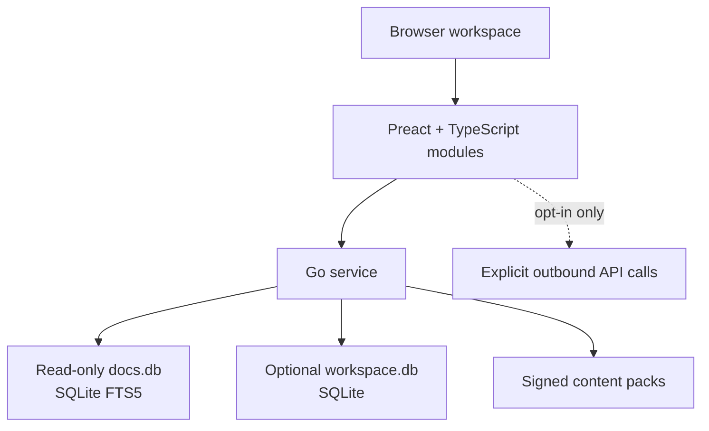

# Developer Toolbox

## A lightweight, offline-capable developer workbench for Docker

## Executive summary

Developer Toolbox is a self-hosted, local-first web workbench that consolidates documentation search, data inspection, API work, code transformation, diagramming, learning, and small daily utilities into one Docker-delivered product. The same image must work on an individual laptop and on an internal server without becoming a background burden.

The recommended product is **not** a bundle of ten cloned websites. It is a single modular application that selectively embeds permissively licensed components and independently implements small utilities behind one consistent workspace model. This avoids a collection of disconnected screens, prevents duplicate runtimes, and keeps the base package small.

The most important capability is offline documentation search. It should use a read-only SQLite FTS5 database, not Elasticsearch. SQLite FTS5 provides built-in relevance ranking and highlighted excerpts in a single local database file; no separate search process or cluster is required.^1 The documentation content, rather than the search engine, determines most of the disk footprint.

The recommended first release is a browser-first Preact frontend plus a compact Go service. Browser code performs transformations and visualizations locally; the service only serves content, manages optional shared workspaces, and safely performs opt-in network requests. The base image should exclude optional documentation packs, API collaboration, real-time whiteboarding, and AI features.

## Product thesis

Modern developers repeatedly leave their IDE to answer small but high-frequency questions: “What does this shell flag do?”, “Where is this JSON field?”, “What type should this response map to?”, “How do I test this endpoint?”, or “How do I explain this flow?”. Each problem has a good web tool, but those tools fragment context, expose confidential snippets to third parties, and usually cannot be used offline.

Developer Toolbox should solve that specific fragmentation. Its value is not a large number of utilities; it is a trusted, fast, locally deployed workspace where tools share inputs, saved snippets, documentation packs, export behavior, security controls, and keyboard conventions.

### Product principles

1. **Local by default.** Pasted text and imported files stay in the browser unless a user explicitly invokes an outbound request or shared workspace action.
2. **One image, two modes.** The same image supports localhost and a shared internal deployment. Shared-only features are disabled by default.
3. **Small baseline, installable packs.** The base image includes the application and a focused docs pack. Larger documentation, integrations, and collaboration are separate packs or optional services.
4. **Useful before clever.** Prioritize frequent engineering tasks over generic “all-in-one” ambitions.
5. **Open standards first.** Use OpenAPI, JSON Schema, SQLite, HTTP, and portable export formats rather than proprietary internal data models.
6. **License-aware composition.** Preserve notices and assess source documentation licenses separately from software licenses. Never assume that source availability permits redistribution.

## Research findings: the original ten services

| Reference service | What is worth carrying forward | Local implementation decision | License / content caution |
| --- | --- | --- | --- |
| DevDocs | Curated offline docs, instant cross-doc search, keyboard navigation | **Core module.** Build a SQLite FTS5 content-pack pipeline; optionally interoperate with DevDocs sources rather than making a full fork | DevDocs is MPL-2.0 and its generated docs require source-license review; its own README asks for attribution of generated documentation.^2 |
| ExplainShell | Token-by-token explanation of a shell command using option help | **Core module, independently implemented.** Parse command structure and consult a curated command/option index | ExplainShell code is GPLv3; its manpage-derived database has mixed upstream licenses, so do not redistribute it wholesale without review.^3 |
| RegExr | Live matching, explanation, test cases, replacements, cheat sheets | **Core module, independently implemented.** Use browser regex engines plus a constrained PCRE-compatible option later | Current RegExr source is GPLv3, which is unsuitable to embed in a proprietary combined app without meeting copyleft obligations.^4 |
| Learn Git Branching | Safe visual Git simulation and structured exercises | **Learning pack.** Include a separate, isolated simulator or an approved fork | Learn Git Branching is MIT-licensed and designed as an interactive Git visualizer/tutorial.^5 |
| VisuAlgo | High-quality algorithm animations and exercises | **Optional learning pack.** Build a smaller curated set first: sorting, trees, graphs, and pathfinding | Treat visible source and educational content as separately reviewable; confirm repository/content rights before redistribution. |
| JSON Crack | Tree/graph view, conversion, schemas, jq/JSONPath, export | **Core module.** Reuse approved Apache-2.0 components or embed an evaluated package | JSON Crack currently declares Apache-2.0, supports local processing, and exposes graph, conversion, schema, jq/JSONPath, and export capabilities.^6 |
| Transform.tools | Fast format/type/schema conversions | **Core module.** Implement a selected transformer registry rather than cloning every conversion | Transform is MIT-licensed and documents self-hosting; the transformer catalogue is a useful design reference.^7 |
| Excalidraw | Quick freeform diagrams, local-first files, PNG/SVG export | **Optional core integration.** Embed the editor package; collaboration stays optional | Excalidraw is MIT-licensed and its editor supports local-first storage, PWA/offline behavior, end-to-end encrypted collaboration, and open `.excalidraw` files.^8 |
| Hoppscotch | HTTP/GraphQL/WebSocket client, collections, environments | **Phase 2 API module.** Build a focused client or run a separately versioned adapter | Hoppscotch is MIT-licensed and supports offline, on-prem, web, desktop, and CLI use; its broader platform should not be pulled into the base image.^9 |
| Carbon | Attractive code-to-image export | **Core utility.** Use a compact local renderer; preserve only the needed theme/export features | Carbon is MIT-licensed and supports configurable source-code images.^10 |

### What this means

The ten services divide into three classes.

**Build natively:** documentation search, shell explanation, regex workbench, structured-data workbench, converters, code image export, and small utilities. These are either small enough to implement cleanly or have licensing/content constraints that make direct reuse imprudent.

**Embed selectively:** Excalidraw and possibly JSON Crack components, after dependency, bundle-size, and license scanning. This provides mature visual interaction without trying to rebuild a whiteboard or graph renderer.

**Offer as optional packs:** Git/algorithm learning and a comprehensive API client. They are valuable but would otherwise dominate scope, content size, or support burden.

## Recommended first-release modules

The following scope is intentionally more useful than the original ten sites while remaining small.

### A. Documentation and reference

1. **Doc Search** — local multi-source documentation search, table of contents, deep links, bookmarks, and copyable permalinks.
2. **Command Reference** — shell command parser, option explanations, examples, safe-command warnings, and a locally indexed selected manpage set.
3. **Standards Shelf** — curated offline references for HTTP, OpenAPI, JSON Schema, regex, Git, Docker, SQL, and common language ecosystems.

OpenAPI should be a first-class source because the specification describes HTTP APIs in a language-agnostic form and enables documentation, client/server generation, and testing tools.^11 JSON Schema 2020-12 should be the supported schema baseline because it provides a common structural-validation vocabulary.^12

### B. Structured-data workbench

1. JSON/YAML/XML/CSV formatter, validator, converter, and diff.
2. Tree and graph explorer with safe limits for enormous inputs.
3. JSON Schema infer, validate, and mock-data preview.
4. Type generation for TypeScript, C#, Java, Kotlin, Go, Python, and Rust.
5. `jq`, JSONPath, and JMESPath panes with saved queries. `jq` is a lightweight structured-data filter language; its operations map naturally to an in-browser workbench.^13
6. JWT decoder and inspector—decode only; no signature verification claim unless a key is supplied.

### C. API workbench

1. Import an OpenAPI document and browse operations.
2. Compose REST requests with environments, variables, headers, auth, and body templates.
3. Inspect response body, timing, headers, and JSON structure.
4. Generate an example request, cURL command, and TypeScript/C# model skeleton.
5. Run local contract validation against OpenAPI/JSON Schema.
6. Export/import a portable collection format.

The initial product must not claim to be a penetration-testing product. API features should instead include guardrails—secret masking, method/host allowlists, explicit warnings for outbound traffic, and redacted exports. APIs expose sensitive logic and data and are a distinct attack surface; OWASP’s API Security project is the right baseline for its secure-design checklist.^14

### D. Developer utilities

1. Regex workbench: JavaScript, .NET-style, and PCRE2-compatible modes clearly labeled by engine.
2. Encoder/decoder: URL, Base64, HTML entities, Unicode, gzip (client-side where practical), and JWT payload.
3. Hash/UUID/time: SHA-256/SHA-512, HMAC when a user supplies a key, UUID, Unix time, timezone converter, cron visualizer.
4. Text/code: formatter, minifier, diff, line sorter/deduplicator, case conversion, escape/unescape, and Lorem/fixture generator.
5. SQL assistant: formatter, dialect-aware linting, explain-plan viewer from pasted output, and safe parameterized-query examples. Do not connect directly to databases in v1.
6. Code image exporter: themes, window chrome, line numbers, transparent/solid backgrounds, PNG/SVG export.

### E. Visual and learning modules

1. Embedded Excalidraw with local `.excalidraw`, SVG, and PNG export.
2. Mermaid text editor with local rendering and export.
3. Git graph sandbox with a selected exercise path: branch, merge, rebase, reset, revert, cherry-pick, and remote simulation.
4. Algorithm visualizer starter set: sorting, BFS/DFS, Dijkstra, heap, binary search tree, and hash-table collision strategies.

### Not in v1

- AI assistant or cloud model integration
- General-purpose code editor/IDE
- Full Git hosting or CI/CD
- Database administration studio
- Team real-time collaboration
- Persistent API secrets vault
- Unrestricted network scanners or security-testing payload libraries
- Full reproduction of third-party community galleries

These are either significant products on their own or introduce unacceptable operational, security, and support weight.

## Architecture

### Runtime composition

### Chosen stack

| Layer | Decision | Rationale |
| --- | --- | --- |
| Web UI | Preact + TypeScript + Vite build | Small React-compatible UI runtime; Node is build-time only |
| Styling | CSS variables + small accessible component primitives | Avoids the bundle cost and lock-in of a large design system |
| Service | Go, statically linked | Compact, fast startup, low idle overhead, simple cross-platform Docker runtime |
| Docs search | SQLite FTS5 | One file, local full-text search, BM25 ranking, snippets/highlights; no search server^1 |
| User persistence | IndexedDB first; optional SQLite for shared server | Zero service state on a laptop; explicit server state only when needed |
| Content packages | Signed archives containing `docs.db`, metadata, licenses, and checksums | Independent updates and clean license provenance |
| Network policy | Disabled by default; opt-in per request | Avoids accidental external disclosure of pasted content |
| Observability | Structured stdout logs only; no telemetry by default | Suitable for private/local operation |

### Data boundaries

**Browser-local data:** drafts, recent tools, snippets, whiteboard autosaves, theme, and tool settings. This is the default for both deployment modes.

**Read-only shared content:** documentation packs, command-reference index, bundled templates, and tutorial definitions. These are mounted or baked into a content image layer.

**Optional server data:** named shared workspaces, collection metadata, administrators, and access policy. This must be separate from the documentation database to avoid write contention and simplify backup/restore.

**Secrets:** never persist by default. API tokens may be held in memory for a session, manually exported only after warning, and always redacted from logs, screenshots, and shared links.

### Documentation index design

Each content pack produces a SQLite file with `documents`, `sections`, `anchors`, `code_examples`, `sources`, and an FTS5 virtual table. Index title, headings, body, tags, language, product version, and source URL separately so headings can have more ranking weight than prose.

Search should be lexical and transparent in v1: quoted phrases, prefix search, source/language filters, and BM25 ordering. SQLite FTS5’s `bm25()` returns better matches as numerically smaller values and supports per-column weighting; its `snippet()` function can return relevant highlighted excerpts.^1 This is exactly the behavior a documentation browser needs without an “elastic” search service.

Optional semantic search should remain a future pack. It adds an embedding model, content reindexing, device-specific performance issues, and data governance questions; it is not required to make documentation search excellent for exact API names, error codes, flags, and identifiers.

## Packaging and operating profiles

| Profile | Included | Expected purpose |
| --- | --- | --- |
| `core` | UI, Go service, utilities, base docs, no writable server DB | Laptop/local Docker use |
| `core-docs-dotnet` | `core` plus .NET, C#, ASP.NET, Angular, TypeScript, SQL docs pack | Product development team default |
| `api` | `core` plus API Workbench, OpenAPI/Schema tooling | API development and QA |
| `learning` | `core` plus Git/algorithms packs | Training/onboarding |
| `team` | `core` plus shared-workspace configuration | Internal server deployment |

Avoid a “one giant image”. Build layered images or mount content packs as volumes. This permits fast core-image updates and lets an organization approve individual documentation licenses before distributing a pack.

### Size and performance targets

These are engineering targets, not guarantees until measured on the final dependency set. .NET and Angular are not runtime dependencies: they are recommended documentation-pack content for teams that use those technologies.

| Metric | Core target | Team target |
| --- | ---:| ---:|
| Compressed image | ≤ 150 MB | ≤ 180 MB, excluding docs packs |
| Idle container RAM | ≤ 60 MB | ≤ 100 MB |
| Cold start | ≤ 2 seconds on a typical developer laptop | ≤ 3 seconds |
| Initial interactive UI | ≤ 2 seconds on localhost | ≤ 3 seconds on LAN |
| Search latency, local docs | p95 ≤ 100 ms for indexed results | p95 ≤ 150 ms |
| Base docs pack | 50–150 MB | 50–150 MB |

The whiteboard, graph layout, and code-image renderer must be lazy-loaded. Large files must be parsed in a Web Worker, with explicit byte/node limits and a fallback tree view. No module should block the first render of the dashboard.

## Security, privacy, and governance

1. Bind localhost by default. A team deployment requires explicit host binding, TLS termination, and authentication configuration.
2. Apply a restrictive Content Security Policy. Do not allow arbitrary remote scripts, fonts, or images.
3. Default-deny outbound HTTP from the application. When API Workbench is enabled, show the method, resolved URL, destination host, and whether the request will leave the private network.
4. Strip authorization headers, cookies, tokens, and common secret patterns from logs and exports. Provide a user-visible redaction preview.
5. Do not proxy browser requests through the Go service by default; doing so can turn the service into an SSRF surface.
6. Use safe archive extraction and signed manifest verification for content packs.
7. Generate SBOMs for every image and content pack; run dependency and license scanning in CI.
8. Maintain a third-party notices view in the product and an immutable source/provenance record per docs pack.
9. Disable public share links in the core product. Shared workspace links need authentication and expiration in a later phase.
10. Do not describe decoding as decryption, and do not claim JWT validity from base64 decoding alone.

## License and content strategy

The product should have its own license and brand. Do not use DevDocs, ExplainShell, RegExr, Carbon, or other upstream product names to market derivative modules without confirming trademark/attribution rules.

Maintain two manifests:

- **Software BOM:** every embedded package, version, SPDX identifier, license text, and notice obligation.
- **Content provenance manifest:** original URL, retrieval date, version, copyright owner, documentation license, redistribution assessment, transformation process, and pack checksum.

The most important diligence item is documentation content. A permissive app license does not grant rights to redistribute every documentation set it can scrape. ExplainShell illustrates the issue directly: its code and its manpage-derived database have different rights and its database contains individually licensed upstream manpages.^3 DevDocs makes a related attribution request for generated documentation.^2

## Delivery roadmap

### Phase 0 — Product foundation (2–3 weeks)

- Monorepo, module contract, design tokens, Docker build, health endpoint, local volume model.
- Go static server; Preact shell; IndexedDB workspace abstraction.
- Module lazy loading, worker protocol, export service, telemetry-free structured logs.
- License/SBOM pipeline and content-pack manifest format.

**Exit criterion:** `docker run` starts the application with no writable filesystem requirement; baseline size and idle-memory measurements are captured in CI.

### Phase 1 — High-frequency core (4–6 weeks)

- JSON/YAML/XML/CSV workbench with format, validate, convert, diff, tree view, and schema infer.
- Regex, text transforms, encoder/decoder, time/UUID/hash, cron, and code-image modules.
- Documentation browser with FTS5, one curated docs pack, bookmarks, and source attribution.
- Secure local export/import and accessibility/keyboard coverage.

**Exit criterion:** the product can replace daily browser use for these small tasks while remaining offline after installation.

### Phase 2 — API and diagrams (4–6 weeks)

- OpenAPI import/browser, request composer, environments, response viewer, and cURL/model generation.
- JSON Schema validation and mock examples.
- Embedded Excalidraw and Mermaid with local export.
- Outbound-request consent, redaction, allowlists, and API security test cases.

**Exit criterion:** a .NET/Angular team can inspect an OpenAPI contract, test a DEV endpoint, inspect the response, generate a starting model, and diagram the integration without sending data to third-party websites.

### Phase 3 — Learning and shared deployment (4–8 weeks)

- Git graph simulator and initial algorithms pack.
- Optional team authentication, server-side shared workspaces, and admin content-pack management.
- Pack update workflow, rollback, audit records for admin actions, and container hardening.

**Exit criterion:** the same release can serve personal and internal-team use without two codebases.

### Phase 4 — Evidence-led extensions

- Optional Typesense adapter only after a measured corpus/concurrency need.
- Controlled real-time collaboration, only if the team demonstrates demand.
- AI-assisted explanation or semantic search only as an isolated, opt-in module with an explicit model/privacy policy.
- VS Code extension/MCP bridge after the web product’s module contracts stabilize.

## Testing and acceptance plan

| Area | Required evidence |
| --- | --- |
| Functional | Unit tests for transformers/parsers; integration tests for module contracts; Playwright end-to-end flows for each core tool |
| Search | Fixture corpus tests for ranking, filters, snippets, special characters, and Unicode |
| Security | Secret-redaction tests, CSP tests, SSRF-negative tests, archive validation tests, dependency/SBOM scans |
| Performance | CI benchmark for image size, cold start, idle RAM, bundle budgets, worker parse time, and search p95 |
| Offline | Network-disabled test after image and pack installation |
| Compatibility | Chromium, Edge, Firefox; desktop first, then tablet/mobile read-only behavior |
| Licensing | Automated NOTICE/SBOM generation and manual content-pack approval gate |

## Decisions requested before implementation

1. Use the working name **Developer Toolbox** or select a product name before public branding.
2. Confirm whether v1 is internal-only or should be engineered from day one for commercial resale; this determines legal review depth, authentication scope, and product analytics policy.
3. Select the first documentation pack. Recommended: **.NET / C# / ASP.NET Core + Angular + TypeScript + Git + Docker + OpenAPI + SQL**.
4. Decide whether API Workbench may send requests to any user-entered host or only an administrator-approved allowlist in team mode. Recommended: localhost and private-network destinations by default; explicit opt-in for public hosts.

## Sources

1. SQLite. “[FTS5 Extension](https://www.sqlite.org/fts5.html).” Accessed September 9, 2026.
2. freeCodeCamp. “[DevDocs: API Documentation Browser](https://github.com/freeCodeCamp/devdocs).” Accessed September 9, 2026.
3. Idan Kamara. “[ExplainShell](https://github.com/idank/explainshell).” Accessed September 9, 2026.
4. gskinner. “[RegExr source repository](https://github.com/gskinner/regexr).” Accessed September 9, 2026.
5. Peter Cottle. “[Learn Git Branching](https://github.com/pcottle/learnGitBranching).” Accessed September 9, 2026.
6. Aykut Sarac. “[JSON Crack](https://github.com/AykutSarac/jsoncrack.com).” Accessed September 9, 2026.
7. Ritesh Kumar. “[Transform](https://github.com/ritz078/transform).” Accessed September 9, 2026.
8. Excalidraw contributors. “[Excalidraw](https://github.com/excalidraw/excalidraw).” Accessed September 9, 2026.
9. Hoppscotch contributors. “[Hoppscotch](https://github.com/hoppscotch/hoppscotch).” Accessed September 9, 2026.
10. Carbon contributors. “[Carbon](https://github.com/carbon-app/carbon).” Accessed September 9, 2026.
11. OpenAPI Initiative. “[OpenAPI Specification v3.1.1](https://spec.openapis.org/oas/v3.1.1.html).” October 24, 2024.
12. JSON Schema. “[Specification: Draft 2020-12](https://json-schema.org/specification).” Accessed September 9, 2026.
13. jqlang. “[jq Manual](https://jqlang.org/manual/).” Accessed September 9, 2026.
14. OWASP Foundation. “[OWASP API Security Project](https://owasp.org/www-project-api-security/).” Accessed September 9, 2026.
